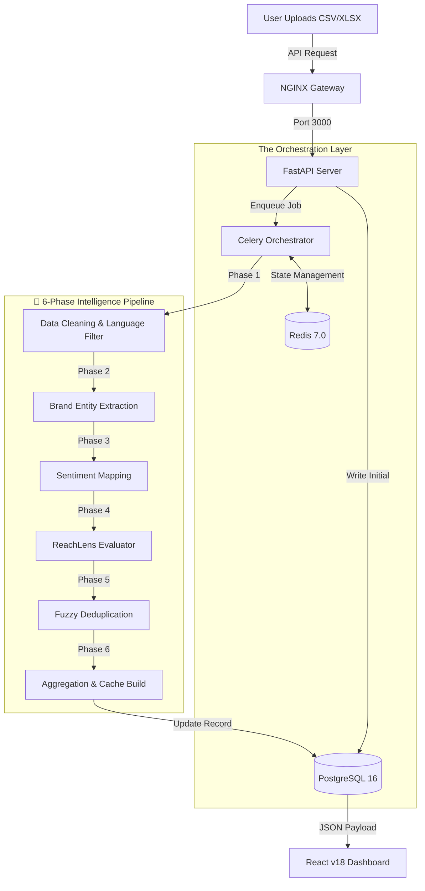

# 🦅 Mavericks V2: The Global Intelligence Engine

  

> **"Transforming raw news data into high-fidelity actionable intelligence."**

**Mavericks V2** is a sophisticated PR analytics and news intelligence platform. Unlike standard dashboards that simply count mentions, Mavericks uses a **multi-phase asynchronous pipeline** to extract brand entities, analyze sentiment across languages, and calculate influence-based reach scores.

---

## 🏗️ System Architecture

How does Mavericks turn a raw CSV into a premium intelligence dashboard?



---

## 🔬 The Intelligence Pipeline: 6 Phases of Processing

Every upload triggers a high-performance background process to ensure data accuracy.

| Phase | Module | Purpose | Tech Used |
| :--- | :--- | :--- | :--- |
| **01** | **Pre-process** | Row normalization, language detection, and cleaning. | Python / Pandas |
| **02** | **NER Engine** | Extracts companies, brands, and people mentioned. | spaCy (en_core_web_md) |
| **03** | **Sentiment** | Calculates tone for every single news article. | NLTK / VADER |
| **04** | **ReachLens** | Calculates impact scores based on outlet tier. | ReachLens Logic v6 |
| **05** | **Dedupe** | Groups identical stories across different publishers. | RapidFuzz |
| **06** | **Aggregation** | Generates pre-computed metrics for instant loading. | SQL Alchemy 2.0 |

---

## 📂 Project Anatomy

-   **`/backend`**: The brain of the operation. Built with FastAPI for high-concurrency performance.
-   **`/frontend`**: A premium React dashboard featuring Glassmorphism UI and dynamic Recharts.
-   **`/nginx`**: The central gateway managing routing between the API and UI.
-   **`/celery`**: Handles the heavy lifting—processing thousands of rows without blocking the UI.

---

## 🚀 Quick Start Guide (Local Deployment)

### 1. Initialize the Environment
Copy the example environment file and adjust your keys if needed:
```bash
cp .env.example .env
```

### 2. Launch the Stack
Use Docker Compose to build and start all 7 microservices in one command:
```bash
docker compose up -d --build
```

### 3. Access the Platform
- **Dashboard**: [http://localhost:3000](http://localhost:3000)
- **API Docs**: [http://localhost:3000/api/v1/docs](http://localhost:3000/api/v1/docs)

---

## 🔧 Maintenance Commands

**View Processing Logs:**
```bash
docker compose logs -f celery_worker
```

**Clear Data Cache:**
```bash
docker compose exec backend python -m app.scripts.clear_cache
```

---

*Built with ❤️ by the Mavericks Intelligence Team | 2026*
